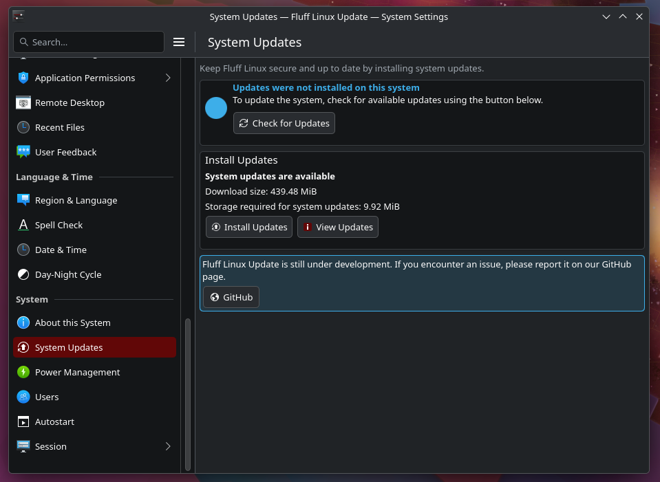
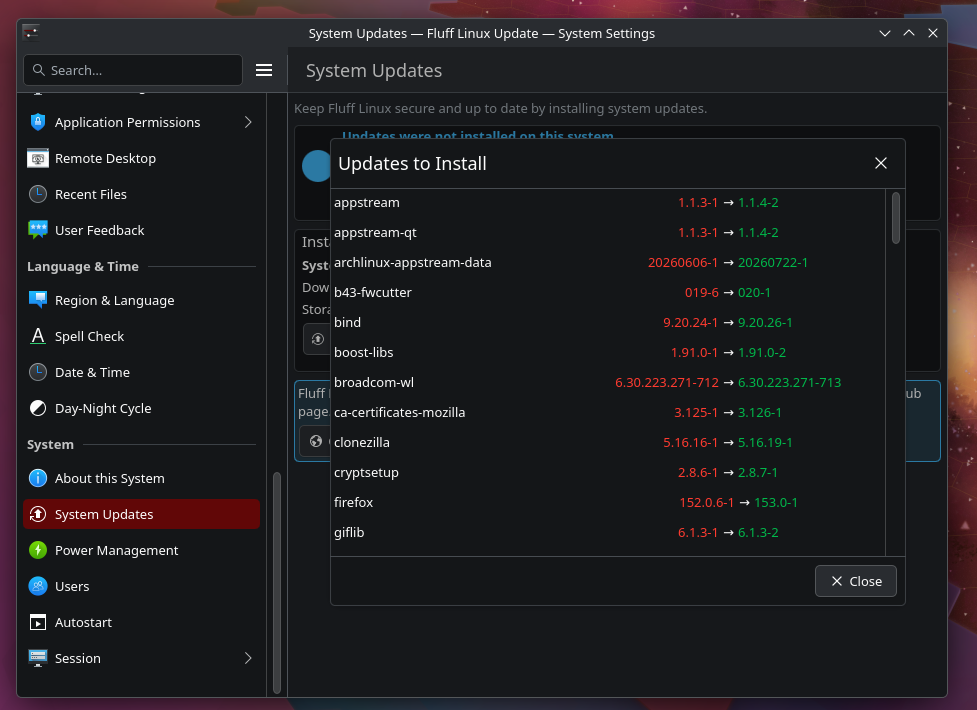
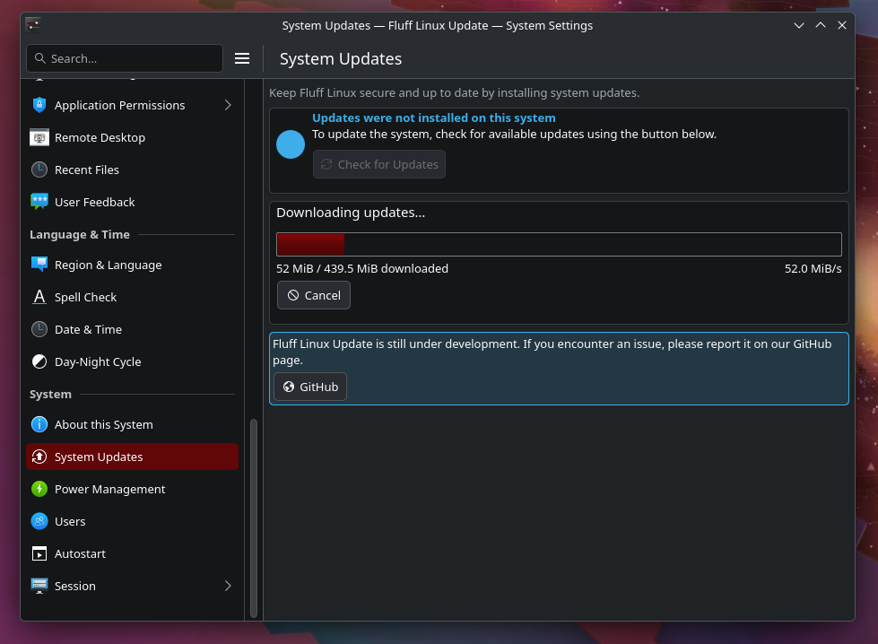
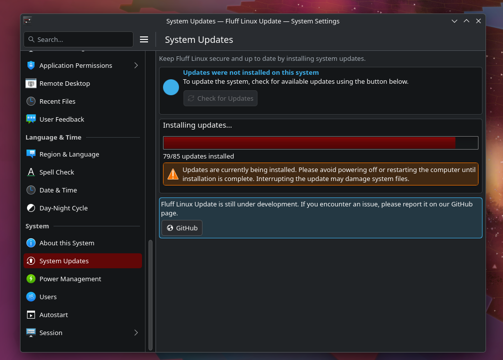
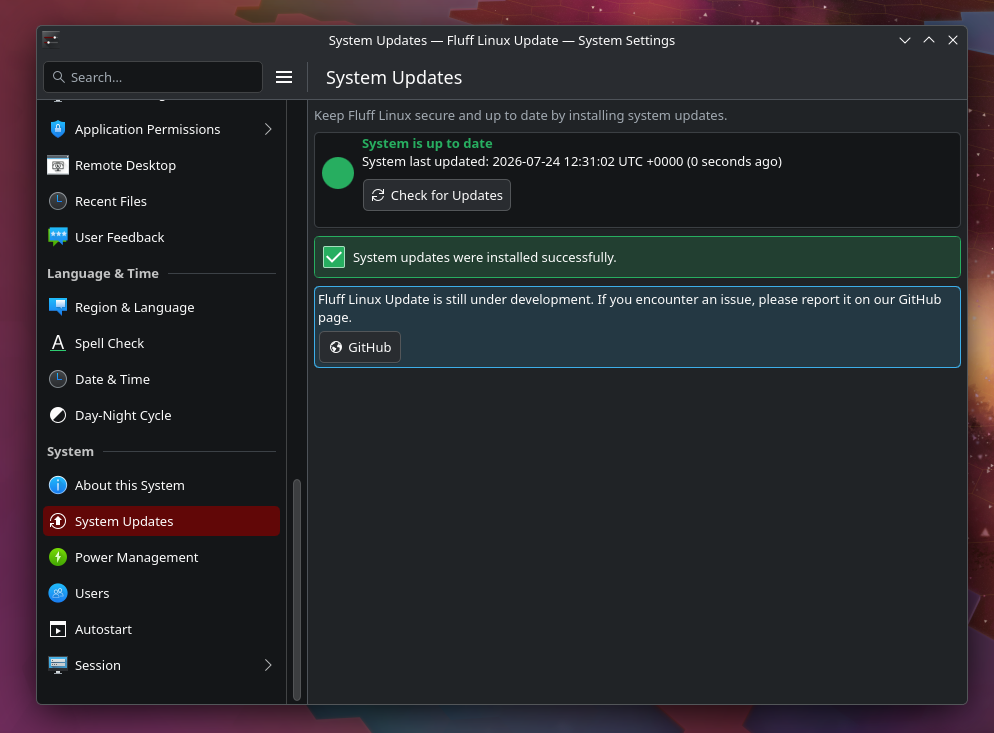

# Fluff Linux Update

Fluff Linux Update is the native KDE Plasma 6 update experience for Fluff
Linux. It lives in System Settings, can also be opened from the application
menu, and keeps manual system updates clear and approachable.



## What it can do

- Check for system updates without changing the real pacman database.
- Show the total download size and expected storage change.
- Preview every package and its old and new version before installation.
- Install updates through polkit using `pacman -Syu --noconfirm`.
- Show live download size, speed, installation progress, and completion.
- Continue an update in the background if the panel is closed.
- Reconnect to an update already in progress when the panel is opened again.
- Detect another running pacman process and handle a stale database lock.
- Protect important packages when an update proposes removing them, ask before
  removing warning-class packages, and automatically clear approved obsolete
  blockers.
- Preserve unmanaged files that conflict with an update, then restart the
  interrupted installation automatically.
- Allow downloads to be cancelled while protecting the installation phase.
- Warn laptop users when the system battery is low.
- Read the last successful update time from
  `/etc/pacman.d/lastupdate.json`.
- Follow the Plasma theme, scale with the window, and support RTL layouts.

The interface includes every official European Union language together with
Arabic, Hebrew, Japanese, and Russian. English remains the source language.

The new package-recovery dialogs introduced in the 1.2 testing build are
currently English only while their wording and behavior are being reviewed.

## A quick look

| Preview updates | Download updates |
| --- | --- |
|  |  |

| Install updates | Finished |
| --- | --- |
|  |  |

## Build on Fluff Linux or Arch Linux

Install the build requirements:

```sh
sudo pacman -S --needed base-devel cmake extra-cmake-modules \
    qt6-declarative kcmutils ki18n kcoreaddons kirigami \
    pacman-contrib polkit
```

Configure and compile:

```sh
cmake -S . -B build \
    -DCMAKE_BUILD_TYPE=Release \
    -DCMAKE_INSTALL_PREFIX=/usr \
    -DCMAKE_INSTALL_LIBDIR=lib
cmake --build build
```

If an older copy was built in the same directory, remove `build/` and
`fakeroot/` first. The
QML interface is embedded in the compiled KCM, so an old build directory can
retain outdated resources and cached non-Arch installation paths.

## Stage for packaging

Fluff Linux packages are assembled from a fakeroot instead of being installed
directly onto the build machine:

```sh
# fakeroot/ becomes the package filesystem and can be passed to the Fluff Linux packaging tools.
DESTDIR="$PWD/fakeroot/" cmake --install build
```

Everything that belongs in the package will now be under `fakeroot/`, beginning
with `fakeroot/usr/`. The package-removal policy is staged separately at
`fakeroot/etc/pacman.d/flufflinux-update-package-protection.json`. This
directory is only a packaging workspace; it is not a
privileged chroot and staging into it does not modify the host system.

Use a clean `fakeroot/` for each package build so files removed in a newer
version cannot remain in the finished package.

## Test locally

On a disposable development system, the staged build can instead be installed
directly:

```sh
sudo cmake --install build
sudo systemctl daemon-reload
kcmshell6 kcm_fluffupdates
```

The panel appears as **System Updates** near the top of the **System** category.
The application launcher also provides **Check for system updates**.

Repository replacements intentionally have no dialog. Automatic removals show
a temporary informational note naming the removed package.

## Languages

Translations are stored in `po/<language>/kcm_fluffupdates.po` and installed
automatically during the packaging step. The translator-friendly string guide
is available in [`po/README.md`](po/README.md).

To verify the staged translation catalogs:

```sh
find "$PWD/fakeroot/usr/share/locale" \
    -path '*/LC_MESSAGES/kcm_fluffupdates.mo' -print
```

The corresponding system locale must also be generated on the installed
system. Fluff Linux Update includes its translation catalogs but does not
change the operating system's locale configuration.

## Project branches

- `main` contains release-ready code used to build the Fluff Linux package.
- `staging` contains tested pre-release changes and is the normal target for
  community pull requests.

Development changes are tested locally before they are added to `staging`.

## State and logs

Fluff Linux Update uses files under `/etc/pacman.d/`:

- `lastupdate.json` records the last successful system update.
- `flufflinux-update-state.json` lets the panel reconnect to an active update.
- `flufflinux-update.log` contains the latest pacman update log.
- `flufflinux-update-package-protection.json` defines protected, warning, and
  autoremove classifications. Packages absent from the file use autoremove.

The existing `lastupdate` hook provides this field:

```json
{
  "last_successful_system_update": "2026-07-20 14:30:00 IDT +0300"
}
```

## Planned next steps

- A detailed failure dialog.
- Reboot recommendations after kernel or hardware-driver updates.
- Optional update notifications.

## License

Fluff Linux Update is available under the [MIT License](LICENSE).
