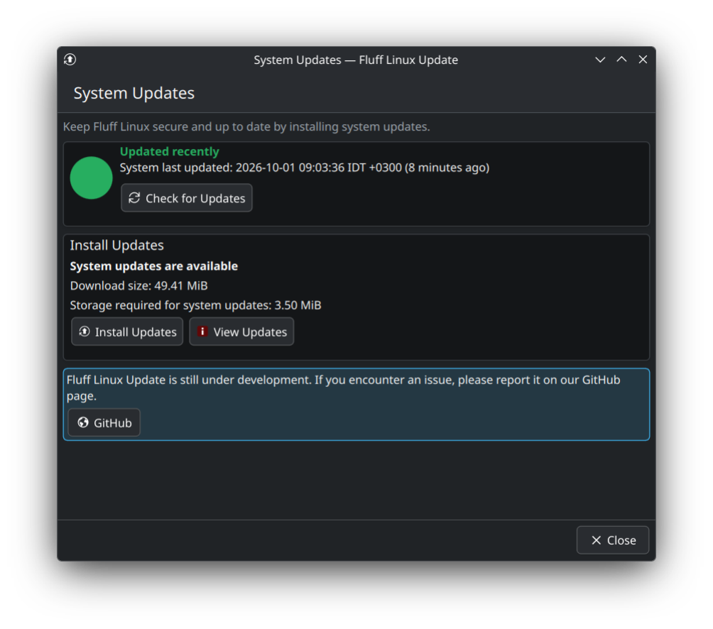
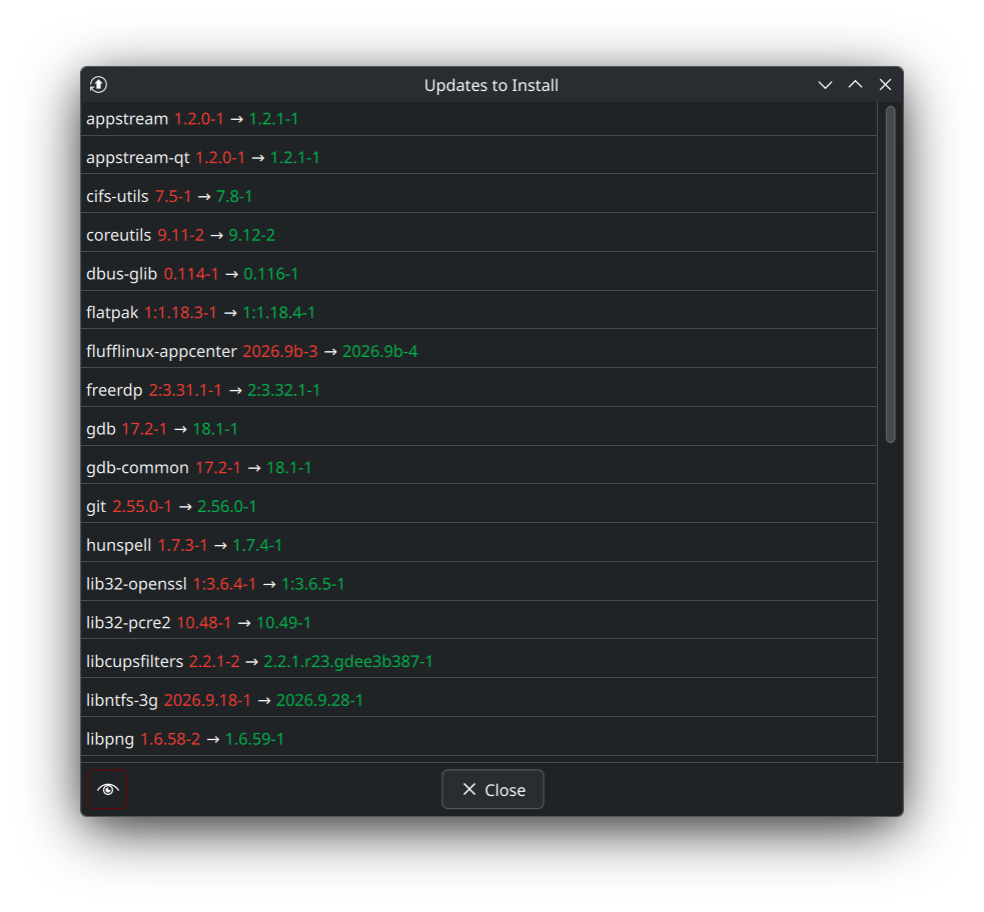

# FLU 1.5: Rust backend and QML interface

## Current status

This draft contains the first implementation stage for version 1.5, not the
completed backend migration. Repository signing-key parsing, certificate
validation, temporary-keyring handling and recovery/rollback decisions now run
in `flu-core`. The panel, helper and worker all call that same Rust code through
`flu_bridge`, built with CXX-Qt 0.10.0. The existing Qt adapters still perform
bounded HTTPS and process I/O.

A Rust-backed Qt `UiState` owns the saved package-list view and window state.
The KDE adapter retains settings I/O and forwards native property notifications
through the existing KCM API. The QML source, package policy, translations,
polkit action, systemd service and transaction helper/worker behavior are
unchanged. The remaining desktop backend and helper/worker execution engines
are still C++ and must be migrated before the 1.5 draft is release-ready.

## Reference implementations

The following repository snapshots were inspected on 1 October 2026:

- [FluffInstall, `2304e22`](https://github.com/FluffNet/fluffinstall/tree/2304e22bc66c5b7b532044fa07bcb48a4ffdccb4):
  Rust 2024, CXX-Qt 0.9, a Rust `InstallerBackend` exposed to QML, background
  installation threads, and progress returned through the Qt thread queue.
- [FluffSetup, `99bb1f5`](https://github.com/FluffNet/fluffsetup/tree/99bb1f5e8a3450cf4619c0aaf78b8011b674d221):
  the same Rust/CXX-Qt stack, a Rust `SetupBackend`, embedded QML, and small
  native adapters for Qt session and window integration.
- [Fluff Linux Calculator, `1d3d704`](https://github.com/FluffNet/flufflinux-calculator/tree/1d3d704e24c69a15f296e30510d298cdd1a92a5f):
  Rust calculation and application state behind `CalculatorBackend`, QML
  controls, the KDE desktop control style, translation loading, and fakeroot
  staging around a locked Cargo release build.
- [Fluff Linux App Center, `2622f0a`](https://github.com/FluffNet/flufflinux-appcenter/tree/2622f0abaf19e1189eb2983554b7c4acf38fd0a4):
  a Rust entry point and catalog code with a manual Qt bridge, QML views, and
  substantial C++ transaction logic. Its packaging and desktop integration
  provide references, while FLU's backend target follows the CXX-Qt pattern
  used by the other three applications.

## Target architecture

The update engine, application state, privileged helper, and persistent worker
will be written in Rust. QML will own presentation and interaction, binding to
properties and methods on a Rust-backed QObject through CXX-Qt 0.10.0. Rust 2024
and a committed Cargo lockfile will match the reference projects.

FLU will retain its System Settings entry and application launcher. A small
native KDE adapter will register the KCM and connect it to the Rust-backed Qt
object. Qt/KDE adapters and generated CXX-Qt glue may remain C++; update
decisions and privileged operations belong in Rust.

The intended separation is:

- A Qt-independent Rust core for transaction parsing, recovery decisions,
  package policy, diagnostics, and persisted state.
- A CXX-Qt Rust backend for the QML interface, with lengthy operations performed
  away from the UI thread and notifications queued onto that thread.
- Rust helper and worker binaries for polkit-controlled operations and systemd
  updates that continue when System Settings closes.
- The KDE KCM adapter and the existing QML interface, retaining native Plasma
  styling, keyboard behavior, touchpad scrolling, and translations.

Cargo builds the Rust components; CMake continues to provide the KDE plugin
and installation integration. The first Rust-backed QObject has been loaded
through the KCM on a Fluff Linux VM. CXX-Qt's documented
[CMake integration](https://kdab.github.io/cxx-qt/book/getting-started/5-cmake-integration.html)
provides the static-library and generated-header mechanism. The CMake-facing
bridge crate deliberately uses an underscore name (`flu_bridge`), keeping
Cargo's crate/export names consistent with Corrosion's target normalization.

## Migration sequence

1. Establish the Cargo workspace and load a CXX-Qt backend through the KCM
   (first state object implemented).
2. Port transaction parsing, security diagnostics, persisted state, and package
   classification into the Rust core, with behavioral regression tests.
3. Port signing-key verification (implemented) and the privileged helper while
   preserving repository attribution, certificate validation, and fail-closed
   decisions.
4. Port the background worker, download/install progress, cancellation, and
   reconnection to an update already in progress.
5. Connect the QML interface to the Rust backend, verify translations and
   desktop behavior, and remove the superseded C++ backend implementation.
6. Validate the complete package on Fluff Linux before making the draft ready
   for review.

## Compatibility and release checks

Version 1.5 must preserve the current update behavior and external integration
contracts, including the helper/worker installation paths, polkit action,
systemd service, package-protection configuration, and last-update/state/log
files. Keep the existing Qt 6.9 minimum unless an actual dependency requires a
different minimum.

Required checks include isolated Pacman transaction and signing-key recovery
regressions; non-FluffNet and ambiguous repository failures; rejected short or
unexpected fingerprints; revoked or unusable key material; signing-subkey and
primary-key rotation; failed HTTPS recovery; package replacements and removal
policy; process and database-lock handling; and interrupted updates.

Desktop validation must cover first-open Close-button focus, Tab navigation,
touchpad momentum, translated errors, Hebrew and Arabic layouts with technical
values kept LTR, cancellation during downloads, installation completion, and
reopening the panel during an active background update. Privileged integration
tests must run on a disposable Fluff Linux system.

Each delivered source ZIP must match its stated commit and include `.PKGINFO`
with the current package version and a refreshed `builddate`.

## Validation record

The first-stage candidate was built, packaged, installed and launched on a
Fluff Linux VM on 1 October 2026. The VM used Qt 6.11.2, KDE Frameworks 6.30,
Rust 1.98.1 and GCC 16.2.1. The previous FLU installation and its package
database entry were backed up before installing version 1.5-1. No full system
upgrade was performed for these tests.

Automated results:

| Suite | Result | Coverage |
| --- | --- | --- |
| Rust core | 4 tests passed | Strict fingerprint format, unique repository attribution, native UTF-16 prompt positions, and no network/keyring access for ambiguous or foreign repositories. |
| Signing-key Qt integration | 77 QtTest entries passed | Disposable real GnuPG certificates, existing-primary refresh, subkey/primary rotation, invalid/revoked/expired/private material, HTTPS failures, trust/import rollback, locks and sanitized diagnostics. |
| Rust Qt state | 8 QtTest entries passed | Default and restored state, one notification per change, saved geometry and minimum-size clamping. |
| QML scrolling calculations | 10 QtTest entries passed | Actual production QML functions: pixel deltas, mouse-wheel steps, retained momentum on retouch, repeated glides, slowing/reversal, bounds and thresholds. |
| AppStream | Passed | Installed application metadata validation. |
| Formatting and lint | Passed | `cargo fmt --all --check` and workspace Clippy with warnings rejected. |

QtTest entry totals include initialization and cleanup. CTest passed all four
registered suites. The root-only Pacman fixture passed all eight scenarios:

1. Update an installed package, install a new dependency and apply a repository
   replacement using only `replaces` metadata. Planning leaves installed
   versions unchanged; the worker downloads and installs the intended versions.
   Real intermediate download progress and all transaction phases were observed.
2. Refuse removal of a protected dependency blocker without changing packages.
3. Return the warning-class dependency blocker for explicit user action.
4. Automatically remove only the approved dependency blocker.
5. Preserve an unmanaged conflicting file and complete the automatic retry.
6. Cancel a download without installing, resume it successfully, reject
   cancellation outside downloading, protect a live Pacman lock and clear only
   an ownerless stale lock.
7. Report a deliberate HTTP download failure without changing the installed
   package version or retaining a database lock.
8. Reject an incorrect check-database user path and fail closed on invalid
   package-protection configuration.

Native desktop checks used the installed candidate in the regular Plasma user
session, not a root GUI or a replacement test interface. The real polkit prompt
authorized a check, available updates were displayed, and the existing update
list opened with Close already highlighted. Tab moved the highlight to the eye
button alone. The view toggle persisted through the Rust state object, Enter
closed the list, reopening restored Close focus, and Space and keypad Enter
also closed it. Screenshots of the main panel and both focus states are included
below. A normal build with testing disabled staged no test programs or fixtures.

### Not yet established

- A complete Rust backend migration: transaction execution and most desktop
  logic are still C++ in this first stage.
- Physical touchpad feel: calculation regressions passed and QML is unchanged,
  but synthetic events cannot establish the behavior of a user's hardware.
- Live graphical download/install completion or reconnecting the GUI during
  an active update: these paths passed backend fixture checks where applicable,
  but were not exercised as a full real-repository graphical upgrade.
- A fresh review of every translation and translated error layout. Translation
  and QML sources were kept byte-for-byte unchanged from `main`.

These checks remain necessary before the completed 1.5 migration is released.
